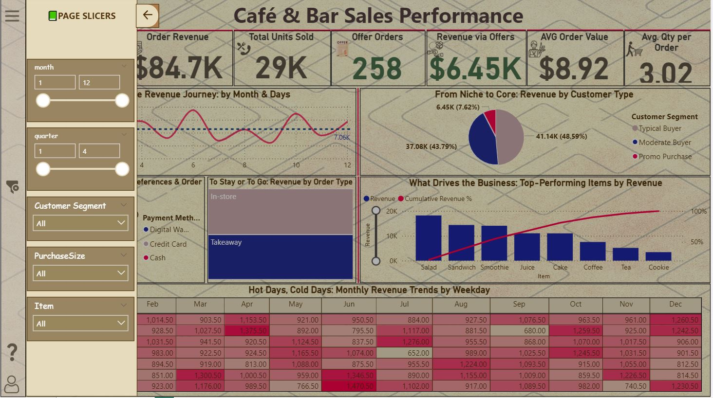
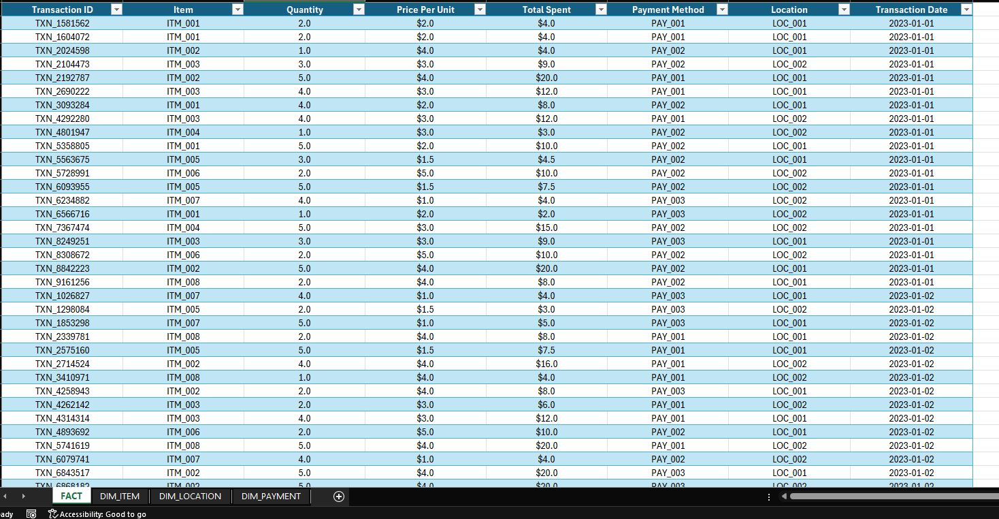
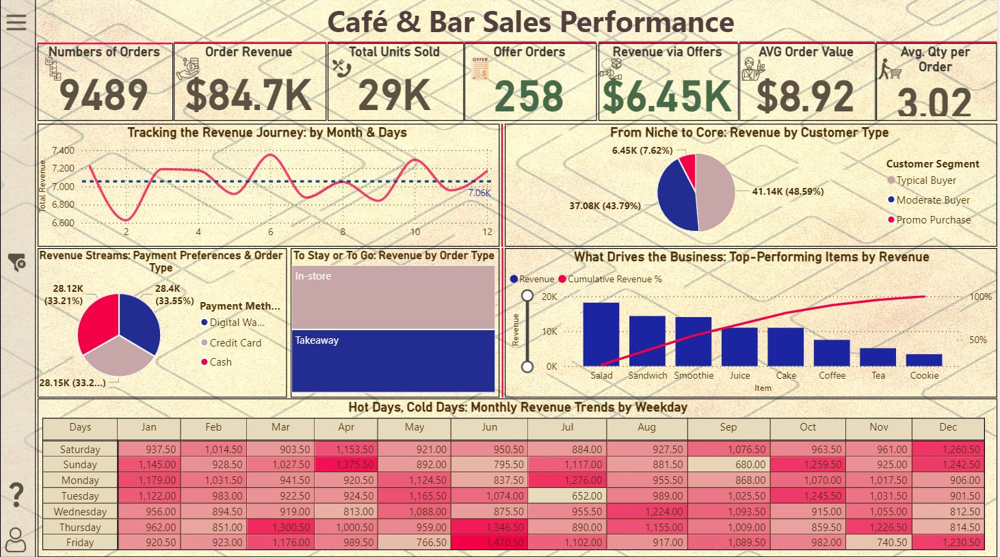

# Coffee-Shop-Sales-Dashboard-Power-BI

Analyzed café sales performance and customer behavior using Power BI.

📊 “Garbage In = Garbage Out” — the golden rule 🔁
And it absolutely applies to data... and business!

So what are we talking about today? 🙄🤔
Let me walk you through how I cleaned and analyzed a real-life dirty dataset — from my perspective as a data analyst. (And yes, every analyst has their own approach 😄)

---

## 🧼 Cleaning the Dataset

I worked with 10,000 rows that had:
* Missing values
* Errors
* Unknown items
* Unknown dates

**🔍 Step-by-step:**

1.  **Understand the data:**
    I started by scanning for patterns, logic, and inconsistencies — especially in numerical fields — to clean without losing important info.
2.  **Unknown Items:**
    * Used `UNIQUE` to list all products and prices.
    * Used `XLOOKUP` to fill missing names based on prices.
3.  **Order Type & Payment Method:**
    * Found behavioral patterns.
    * Filled missing values using actual distribution (49% Takeaway, 51% In-store).
4.  **Transaction Dates:**
    * No clear link found between ID & date.
    * Checked data types, duplicates, and patterns.
    * Some rows stayed unresolved — saved for future review.

**✅ Result:**
Cleaned ~95% of the data. Around 400 rows (5%) remained dirty but were preserved for transparency.

---

## 📊 Analysis & Modeling

* Identified outliers and special offers.
* Built a **star schema** for efficient analysis.
* Added segmentation columns (e.g., day part, day of week).
* Utilized **Power BI** for creating interactive visualizations and dashboards.

---

## 🛠️ Tools Used

* **Microsoft Excel:** For initial data exploration, cleaning (`UNIQUE`, `XLOOKUP`), and pattern identification.
* **Power BI:** For data modeling (Star Schema), DAX calculations, visualization, and dashboard creation.

---

## 📌 Key Insights & Dashboard Preview

**Key Metrics:**
* **Total Orders:** 9,489
* **Total Revenue:** $84.7K
* **Avg. Order Quantity:** 3 items
* **Avg. Order Value:** $8.92
* **Offers Sold:** 258 (Revenue: $6.45K)

**Discoveries:**
* **Top Product:** Salad accounted for 21.5% of total revenue.
* **Pareto Principle:** The top 5 best-selling items generated 80% of the total revenue.
* **Offers Impact:** Special offers contributed 7.62% to the total revenue.
    * 👉 **Suggestion:** Create combo offers pairing top-selling items with lower-performing ones to boost overall sales.
* **Heatmap Analysis:** Revealed higher customer traffic and revenue on hotter days, while colder days showed significantly lower activity.

[**View the Interactive Dashboard Live Here**](https://app.powerbi.com/view?r=eyJrIjoiMzYwMWU2ZGYtOTFmNy00NTEwLTk0MWEtYzY0OGM2NWM1OTU0IiwidCI6IjJiYjZlNWJjLWMxMDktNDdmYi05NDMzLWMxYzZmNGZhMzNmZiIsImMiOjl9)

## 🎯 Conclusion

The primary goal of this project was to practice essential data cleaning techniques, explore real-world data patterns, and enhance my data analysis and visualization skills using Power BI.

I’m glad to share the final outcome with you!

---

💬 **Feedback Welcome!**
If you have any suggestions, improvements, or questions — please leave a comment or open an issue! I’d love to hear your thoughts 😊

And don’t forget to star ⭐ the repository if you found it useful.

Thanks for your time! 🙌
